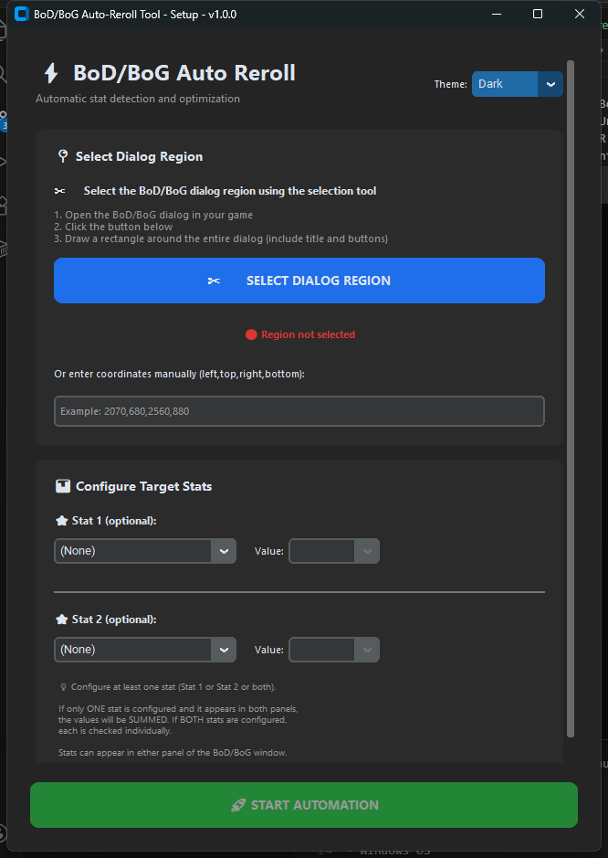

# ⚡ BoD/BoG Auto-Reroll Tool

An automated Blessing of the Demon (BoD) and Blessing of the Goddess (BoG) reroll tool for Flyff Universe. This application automatically detects stats using OCR (Optical Character Recognition) and rerolls your item until target stats are achieved.

## 🖼️ Screenshot



## ✨ Features

- 🎯 **Accurate Stat Detection** - Uses OCR with word boundary matching to prevent stat conflicts (e.g., Speed vs AttackSpeed)
- 🔄 **Smart Rerolling** - Automatically clicks the reroll button until target stats are met
- 📊 **Dual Stat Support** - Configure one or two target stats with minimum values
- ➕ **Stat Summing** - When only one stat is configured, values from both panels are summed
- 🎚️ **Adaptive Value Dropdowns** - Value options automatically update based on selected stat
- 💾 **Configuration Persistence** - All settings preserved when reconfiguring (coordinates, stats, values)
- ✂️ **Visual Region Selection** - Snipping tool interface for easy dialog region selection
- 🎨 **Modern GUI** - Clean, intuitive interface built with CustomTkinter
- 🪟 **GUI-Based Interactions** - All prompts and confirmations appear in the app (no terminal required)
- 🔍 **Real-time Logging** - Monitor OCR detection and automation status with timestamped logs
- ⚙️ **Reconfigurable** - Change settings without restarting the application
- 🎭 **Theme Support** - Switch between Light, Dark, and System themes
- 🛑 **Clean Termination** - Properly stops automation when closing the window
- 📌 **Version Display** - Version number shown in window titles for easy tracking

## 📋 Requirements

- Windows OS
- Flyff Universe game client
- Python 3.8+ (for development)
- Tesseract OCR (included in release)

## 🚀 Usage (End Users)

### Quick Start

1. **Download the release**
   - Get the latest `bod-auto.exe` from the releases page
   - Extract to a folder (includes `tesseract` folder and `stats.txt`)

2. **Launch the application**
   - Run `bod-auto.exe`
   - The configuration window will appear

3. **Configure your settings**

   **STEP 1: Select Dialog Region**
   - Open Flyff Universe and display the BoD/BoG blessing dialog
   - Click "✂️ SELECT DIALOG REGION" button
   - The screen will overlay with a gray transparent layer
   - Click and drag to draw a rectangle around the entire blessing dialog
   - Include the title, stat panels, and buttons in your selection
   - Press ESC to cancel if needed

   **Alternative:** Manually enter coordinates in format `left,top,right,bottom` (e.g., `813,153,1339,494`)

   **STEP 2: Configure Target Stats**
   - **Stat 1 (Optional):** Select your primary stat from dropdown
     - Value dropdown automatically shows valid options for that stat (e.g., STR: 0-5)
     - Select your minimum target value
   - **Stat 2 (Optional):** Select your secondary stat and minimum value
     - Each stat has predefined value ranges based on game mechanics
   - Configure at least one stat
   - START AUTOMATION button becomes enabled when all requirements are met

   **Stat Behavior:**
   - If only ONE stat configured → Values from BOTH panels are SUMMED
   - If BOTH stats configured → Each checked INDIVIDUALLY
   - Stats can appear in either Stat 1 or Stat 2 panel of the dialog
   - When switching stats during reconfiguration → value dropdown updates immediately

4. **Start automation**
   (template matching at 0.9 confidence) - Click it when found - Read stats using OCR (3x upscaling with binary threshold preprocessing) - Check if targets are met - Automatically reroll if targets not achieved
   - Window stays on top while automation is running

5. **When targets are met**
   - A GUI dialog appears in the app window: "🎉 Target Stats Found!"
   - "Do you want to continue re-awakening?"
   - Click "Yes" to continue rerolling
   - Click "No" to stop automation
   - No terminal interaction required - everything is in the app

6. **Reconfiguration**
   - Click "⚙️ Reconfigure" button in the automation window
   - Configuration window opens with ALL previous settings preserved:
     - Region coordinates restored
     - Previously selected stats shown
     - Target values maintained
   - Make any changes:
     - Switch to different stat → value dropdown updates immediately
     - Adjust target values
     - Reselect region if needed
   - Click "🚀 START AUTOMATION" to resume with updated settings
7. **When targets are met**
   - Automation pauses
   - Console prompts: `Do you want to re-awake? (y/n):`
   - Type `y` to continue rerolling
   - Type `n` to stop automation

### Available Stats

Check `stats.txt` file for the complete list. Common stats include:

- **Attributes:** STR, DEX, INT, STA
- **Combat:** Attack, Defense, CriticalChance, CriticalDamage
- **Speed:** Speed, AttackSpeed, CastingSpeed
- **Resources:** HP, MP, FP
- **Advanced:** PvEDamage, Parry, MeleeBlock, RangedBlock

### Tips for Best Results

1. \*\*Region Sutomatically filtered based on selected stat type
   - Single stat mode is useful for maximizing one attribute
   - Value dropdowns adapt immediately when changing stats

2. **Reconfiguration**
   - All settings are preserved when you click "⚙️ Reconfigure"
   - Only change what you need - everything else stays the same
   - Value dropdown automatically updates when switching stats
   - Ensure the entire dialog is captured including borders
   - Don't make the region too large (avoid background elements)
   - Keep the game window in the same position during automation

3. **OCR Accuracy**
   - Use clear, high-contrast game settings
   - Ensure the dialog is fully visible and not obscured
   - Avoid transparent or overlapping windows

4. **Stat Configuration**
   - Stat names must exactly match those in `stats.txt`
   - Values are based on game mechanics (see stat value ranges)
   - Single stat mode is useful for maximizing one attribute

## 🛠️ Development

### Prerequisites

1. **Python 3.8 or higher**

   ```bash
   python --version
   ```

2. **Install dependencies**

   ```bash
   pip install -r requirements.txt
   ```

   Or manually:

   ```bash
   pip install pyautogui pytesseract pillow opencv-python customtkinter numpy
   ```

3. **Install Tesseract OCR**
   - Download: [Tesseract OCR v5.5.0](https://github.com/tesseract-ocr/tesseract/releases/download/5.5.0/tesseract-ocr-w64-setup-5.5.0.20241111.exe)
   - Install to project folder: `./tesseract/`
   - Ensure structure: `./tesseract/tesseract.exe` exists
   - Required files:
     - `tesseract.exe`
     - `tessdata/eng.traineddata`
     - `tessdata/osd.traineddata`

### Running from Source

```bash
python bod-auto.py
```

### Project Structure

```
autobod/
├── bod-auto.py          # Main application
├── bod-auto.spec        # PyInstaller specification
├── build-app.bat        # Build script for Windows
├── requirements.txt     # Python dependencies
├── stats.txt           # Available stats list
├── button_image.png    # Reference button image
├── assets/
│   └── tool-screenshot.png  # UI screenshot used in README
├── README.md           # This file
├── tesseract/          # Tesseract OCR installation
│   ├── tesseract.exe
│   └── tessdata/
│       ├── eng.traineddata
│       └── osd.traineddata
└── dist/               # Built executable (after build)
    └── bod-auto.exe
```

### Building Executable

1. **Install PyInstaller**

   ```bash
   pip install pyinstaller
   ```

2. **Run build script**

   ```bash
   build-app.bat
   ```

3. **Output location**
   - Executable: `./dist/bod-auto.exe`
   - Includes all dependencies

### Build Script Details

The `build-app.bat` / `bod-auto.spec` configuration:

- Bundles Python runtime
- Includes Tesseract OCR engine
- Packages `stats.txt` and `button_image.png`
- Creates single-file executable
- Console enabled for debug output

### Modifying Available Stats

Edit `stats.txt`:

```
STR
DEX
INT
CriticalChance
Attack
...
```

Rules:

- One stat name per line
- No spaces (use CriticalChance, not Critical Chance)
- Case-sensitive (must match in-game text)
- Update `stat_values` dict in `bod-auto.py` for dropdown values

### Understanding the Code

**Main Components:**

1. **ConfigUI Class** - Configuration window
   - Region selection (snipping tool)
   - Stat dropdown selectors
   - Target value configuration
   - Theme switcher

2. **StatusWindow Class** - Automation window
   - Real-time activity logging
   - Start/Stop controls
   - Reconfiguration option
   - Status indicators

3. **capture_and_check()** - OCR detection
   - Screenshots the selected region
   - Preprocesses image (grayscale, threshold, resize)
   - Runs Tesseract OCR
   - Parses stat values using regex
   - Compares against targets
   - Supports stat summing for single-stat mode

4. **click_image()** - Button detection
   - Uses template matching
   - Finds reroll button on screen
   - Triggers OCR check
   - Handles user prompts

**OCR Preprocessing Pipeline:**

```python
# 1. Capture region
screenshot = ImageGrab.grab(bbox=region)

# 2. Convert to grayscale
gray = cv2.cvtColor(screenshot_cv, cv2.COLOR_BGR2GRAY)

# 3. Upscale 3x for better OCR
gray = cv2.resize(gray, fx=3, fy=3)

# 4. Binary threshold
_, thresh = cv2.threshold(gray, 150, 255, cv2.THRESH_BINARY_INV)

# 5. Noise reduction
thresh = cv2.medianBlur(thresh, 3)

# 6. Character enhancement
thresh = cv2.erode(thresh, kernel)
```

### Customization

**Adjust OCR Settings:**

```python
# In capture_and_check() function
config = r'--psm 6 -c tessedit_char_whitelist=ABCDEFGHIJKLMNOPQRSTUVWXYZabcdefghijklmnopqrstuvwxyz0123456789+.%# '
```

**Modify Stat Value Ranges:**

```python
# In ConfigUI.__init__()
self.stat_values = {
    'STR': [0, 1, 2, 3, 4, 5],
    'CriticalChance': [0, 0.5, 1.0, 1.5, 2.0, 2.5],
    # Add your custom ranges
}
```

**Change Button Detection Confidence:**

```python
# In click_image() function
location = pyautogui.locateCenterOnScreen(image_path, confidence=0.9)
```

### Debugging

1. **Enable OCR output visualization**
   - Uncomment debug lines in `capture_and_check()`
   - Saves preprocessed images to disk

2. **Check console output**
   - OCR detected text
   - Regex matches
   - Stat comparisons
   - **Value dropdown empty:** Ensure stat exists in `stat_values` dictionary
   - **Settings not preserved during reconfiguration:** Use "⚙️ Reconfigure" button, not window close
   - Error messages

3. **Common Issues**
   - **OCR not detecting stats:** Adjust threshold value (150), try different values
   - **Wrong button clicked:** Update `button_image.png` template
   - **Stats not matching:** Verify stat names in `stats.txt` match game text exactly

## 🔧 Troubleshooting

### Application won't start

- Ensure `tesseract` folder exists with `tesseract.exe`
- Check `stats.txt` is present
- Run from console to see error messages

### OCR not detecting stats

- Verify region includes the entire stats area
- Check game resolution and UI scale
- Ensure dialog is fully visible (no overlays)
- Try adjusting in-game brightness/contrast

### Button not being found

- Update `button_image.png` with current b

### Value dropdown issues

- **Empty after stat selection:** Try selecting "(None)" then reselecting your stat
- **Wrong values shown:** Each stat has predefined ranges in `stat_values` dictionary
- **Not updating when changing stat:** This should happen automatically - check console for errors

### Reconfiguration not working

- **Settings lost:** Always use "⚙️ Reconfigure" button, not window close
- **Previous values not shown:** Ensure configuration was started successfully before
- **Value dropdown stuck:** Change stat to "(None)" and back to reset dropdown state

### Button not being found

- Update `button_image.png` with current button screenshot
- Ensure game window is active and visible
- Check button confidence threshold

### Stats not summing correctly

- Verify only ONE stat is configured (not both)
- Check OCR is detecting both stat panels
- Review console output for matched values

## 📝 Changelog

### v1.0.0 (Current)

- ✨ **NEW**: Configuration persistence - all settings preserved during reconfiguration
- ✨ **NEW**: Adaptive value dropdowns - options automatically update based on selected stat
- ✨ **NEW**: GUI-based confirmations - all prompts appear in app window (no terminal)
- ✨ **NEW**: Immediate dropdown updates when changing stats during reconfiguration
- ✨ **NEW**: Smart value preservation - keeps valid values when switching stats
- ✨ **NEW**: Enhanced reconfiguration logic with proper state management
- 🔧 **IMPROVED**: Window close handler for clean process termination
- 🔧 **IMPROVED**: Better feedback with region dimensions display
- 🔧 **IMPROVED**: Clearer activity log messages with color-coded emojis
- ✨ Complete UI overhaul with CustomTkinter
- ✂️ Visual region selection with snipping tool
- 📊 Dual stat support with dropdown selectors
- ➕ Automatic stat summing for single-stat mode
- 🔄 Reconfiguration without restart
- 🎨 Modern dark theme interface
- 📈 Improved OCR accuracy (simpler preprocessing)
- 🛑 Proper process termination on window close

## 📄 License

This project is licensed under the MIT License - see the [LICENSE](LICENSE) file for details.

## 🤝 Contributing

Contributions are welcome! Please feel free to submit issues or pull requests.

### Development Guidelines

- Follow PEP 8 style guide
- Add comments for complex logic
- Test OCR with various game resolutions
- Update README for new features

## 🙏 Credits

- **Tesseract OCR** - Google's open-source OCR engine
- **CustomTkinter** - Modern UI library for Python
- **OpenCV** - Image processing library
- **PyAutoGUI** - Automation library

## ⚠️ Disclaimer

This tool is for educational purposes. Use at your own risk. Automated tools may violate game terms of service. The authors are not responsible for any consequences of using this software.
